# AI Novel To Screenplay

AI 小说转剧本工具 — 将多章节网络小说自动转换为结构化 YAML 影视剧本。


## 功能概览

- **智能章节识别**: 自动识别「第X章」「Chapter X」等多种章节格式，无标记时按字数自动分段
- **角色提取**: AI 从全文提取主角/配角/反派/NPC，含性格、目标、关系网络
- **剧情分析**: 提炼主线/支线/关键冲突/转折点，生成剧情节拍表
- **场景拆分**: 识别时间/地点切换点，拆分为可拍摄场景（含场景标题、参与角色、剧情目标）
- **对白生成**: 将叙述文字转换为影视化口语对白，含潜台词和情感标注
- **镜头建议**: 自动推荐 establishing/close_up/medium_shot 等 10 种镜头类型
- **质量评分**: 从结构/对白/节奏/角色一致性 4 个维度评分
- **一致性检查**: 自动检测角色引用错误、场景编号连续性
- **多轮修改**: 支持自然语言指令修改剧本（如「把第三场改成夜晚」）
- **YAML 下载**: 一键导出结构化 YAML 剧本

## 快速开始

### 环境要求

- Python 3.11+
- Node.js 18+
- LLM API Key（Claude / GPT / DeepSeek / Qwen 任选其一）

### 安装

```bash
# 克隆仓库
git clone <repo-url>
cd QiNiuYun

# 后端依赖
python -m venv venv
source venv/bin/activate  # Windows: venv\Scripts\activate
pip install -r requirements.txt

# 前端依赖
cd frontend
npm install
cd ..
```

### 配置 LLM

```bash
# DeepSeek（推荐）
export LLM_PROVIDER=deepseek
export ANTHROPIC_AUTH_TOKEN=your-api-key
export ANTHROPIC_BASE_URL=https://api.deepseek.com/anthropic

# Claude
export LLM_PROVIDER=claude
export ANTHROPIC_API_KEY=your-api-key

# OpenAI
export LLM_PROVIDER=openai
export OPENAI_API_KEY=your-api-key

# Qwen（通义千问）
export LLM_PROVIDER=qwen
export DASHSCOPE_API_KEY=your-api-key
```

### 运行

```bash
# 终端1: 启动后端 (http://localhost:8000)
cd backend
python main.py

# 终端2: 启动前端 (http://localhost:3000)
cd frontend
npm run dev
```

打开浏览器访问 `http://localhost:3000`，粘贴小说文本或上传 txt/md 文件即可开始转换。

## 系统架构

```
┌──────────────────────────────────────────────────────┐
│                   前端 (Next.js 14)                    │
│  文本输入 · 文件上传 · 剧本预览 · 评分展示 · YAML下载   │
└──────────────────────┬───────────────────────────────┘
                       │ HTTP REST
┌──────────────────────▼───────────────────────────────┐
│                  后端 (FastAPI)                        │
│  POST /api/parse · POST /api/modify · GET /api/health │
└──────────────────────┬───────────────────────────────┘
                       │
┌──────────────────────▼───────────────────────────────┐
│              LangGraph Agent 工作流                    │
│                                                       │
│  Parser ──► Character ──► Plot ──► Scene ──► Dialogue│
│                                           │          │
│                                           ▼          │
│                              Screenplay Assembler     │
│                              + 评分 + 一致性检查       │
└──────────────────────┬───────────────────────────────┘
                       │
┌──────────────────────▼───────────────────────────────┐
│              统一 LLM Provider                        │
│  Claude · GPT-4o · DeepSeek · Qwen                   │
└──────────────────────────────────────────────────────┘
```

### Agent 工作流（Mermaid）

```mermaid
graph TD
    A[输入: 多章节小说] --> B[Novel Parser<br/>章节识别]
    B --> C[Character Extractor<br/>角色提取]
    C --> D[Plot Analyzer<br/>剧情分析]
    D --> E[Scene Splitter<br/>场景拆分]
    E --> F[Dialogue Generator<br/>对白生成]
    F --> G[Screenplay Assembler<br/>剧本组装]
    G --> H[输出: YAML 剧本]
    G --> I[质量评分]
    G --> J[一致性报告]

    style A fill:#1a1a2e,stroke:#7dd3fc
    style H fill:#1a1a2e,stroke:#a5d6a7
```



## 项目结构

```
QiNiuYun/
├── agents/                   # 6 个 LangGraph Agent
│   ├── __init__.py
│   ├── parser.py             # 章节解析（正则 + LLM 回退）
│   ├── character_agent.py    # 角色提取
│   ├── plot_agent.py         # 剧情分析
│   ├── scene_agent.py        # 场景拆分
│   ├── dialogue_agent.py     # 对白生成 + 多轮修改
│   ├── screenplay_agent.py   # 剧本组装 + 镜头 + 评分 + 一致性
│   └── workflow.py           # LangGraph 工作流编排
├── backend/                  # FastAPI 后端
│   ├── __init__.py
│   ├── main.py               # API 入口 + 路由
│   ├── config.py             # LLM 配置管理
│   ├── llm_provider.py       # 统一 LLM 封装
│   └── schema_doc.py         # Schema 文档生成
├── frontend/                 # Next.js 14 前端
│   ├── app/
│   │   ├── globals.css       # Tailwind + 全局样式
│   │   ├── layout.tsx        # 根布局
│   │   └── page.tsx          # 主页面
│   ├── next.config.js
│   ├── tailwind.config.ts
│   └── package.json
├── schemas/                  # 数据模型
│   ├── __init__.py
│   └── screenplay_schema.py  # Pydantic v2 模型
├── docs/                     # 文档
│   ├── architecture.md       # 系统架构
│   ├── schema.md             # YAML Schema 规范
│   └── workflow.md           # Agent 工作流详解
├── examples/                 # 示例
│   ├── novel.txt             # 示例小说（3章）
│   └── screenplay.yaml       # 示例输出
├── requirements.txt
└── README.md
```

## API 接口

| 方法 | 路径 | 说明 |
|------|------|------|
| `POST` | `/api/parse` | 粘贴小说文本，返回结构化 YAML 剧本 |
| `POST` | `/api/parse/file` | 上传小说文件（txt/md），返回 YAML 剧本 |
| `POST` | `/api/modify` | 根据自然语言指令修改已有剧本 |
| `GET` | `/api/health` | 健康检查 |
| `GET` | `/api/schema` | 查看完整 Schema 文档 |
| `POST` | `/api/schema/generate` | 自动生成 schema.md |

### 请求示例

```bash
# 文本解析
curl -X POST http://localhost:8000/api/parse \
  -H "Content-Type: application/json" \
  -d '{"text": "第一章 重生\n\n林凡睁开眼..."}'

# 文件上传
curl -X POST http://localhost:8000/api/parse/file \
  -F "file=@novel.txt"

# 多轮修改
curl -X POST http://localhost:8000/api/modify \
  -H "Content-Type: application/json" \
  -d '{"screenplay_data": {...}, "instruction": "把第三场改成夜晚"}'
```

### 响应格式

```json
{
  "yaml": "title: 重生之青云\ncharacters:\n  - id: char_001\n...",
  "data": {
    "title": "重生之青云",
    "characters": [...],
    "scenes": [...],
    "score": { "structure": 85, "dialogue": 80, "pacing": 88, "character_consistency": 85, "overall": 84 },
    "consistency_report": { "passed": true, "issues": [], "issue_count": 0 }
  },
  "processing_time_ms": 76200
}
```

## 输出格式

生成的 YAML 剧本完整结构见 [docs/schema.md](docs/schema.md)，包含：

- **元信息**: 生成工具、版本、来源章节数、字数、处理耗时
- **角色**: ID、姓名、性别、年龄、角色定位、性格、目标、背景、关系网络
- **剧情节拍**: 主线/支线/冲突/转折点，关联章节和场景
- **场景**: 场景标题（INT./EXT.、地点、时间）、参与角色、剧情目标、动作描述
- **对白**: 说话者、内容、潜台词、情感标注
- **镜头建议**: 10 种镜头类型（close_up/medium_shot/wide_shot/establishing 等）
- **质量评分**: 结构/对白/节奏/角色一致性 4 维评分（0-100）
- **一致性报告**: 角色引用检查、场景编号连续性

## 技术选型

| 层级 | 技术 | 理由 |
|------|------|------|
| 前端 | Next.js 14 + React + Tailwind CSS | SSR 支持，App Router，原子化 CSS 快速开发 |
| 后端 | Python FastAPI | 异步高性能，自动 OpenAPI 文档生成 |
| Agent 编排 | LangGraph | 有向无环图工作流，类型安全的状态管理 |
| LLM 封装 | 统一 Provider 模式 | 环境变量一键切换 4 种模型，零代码改动 |
| 数据模型 | Pydantic v2 | 类型安全，自动序列化/校验，IDE 友好 |
| 输出格式 | YAML | 高可读性，支持注释，影视行业标准 |

## 第三方依赖

### Python（后端）

| 包名 | 版本 | 用途 | 许可证 |
|------|------|------|--------|
| fastapi | >=0.115.0 | Web 框架 | MIT |
| uvicorn | >=0.32.0 | ASGI 服务器 | BSD |
| langgraph | >=0.2.0 | Agent 工作流编排 | MIT |
| langchain-core | >=0.3.0 | LLM 抽象层 | MIT |
| pydantic | >=2.0.0 | 数据校验 | MIT |
| httpx | >=0.27.0 | HTTP 客户端 | BSD |
| pyyaml | >=6.0 | YAML 序列化 | MIT |
| python-multipart | >=0.0.12 | 文件上传解析 | Apache 2.0 |

### Node.js（前端）

| 包名 | 版本 | 用途 | 许可证 |
|------|------|------|--------|
| next | 14.x | React 框架 | MIT |
| react | 18.x | UI 库 | MIT |
| tailwindcss | 3.x | CSS 框架 | MIT |
| typescript | 5.x | 类型系统 | Apache 2.0 |

### LLM 服务

| 服务 | 接口协议 | 用途 |
|------|---------|------|
| DeepSeek | Anthropic Messages API | 主要 LLM |
| Anthropic Claude | Anthropic Messages API | 备选 LLM |
| OpenAI GPT | OpenAI Chat Completions API | 备选 LLM |
| 阿里 Qwen | OpenAI Chat Completions API | 备选 LLM |

## 原创功能说明

本项目核心原创功能：

1. **6 阶段 LangGraph 流水线**: 从小说到剧本的完整 Agent 编排
2. **批量 LLM 调用优化**: 将多场景/多章节处理合并为单次批量调用，减少 5 倍 LLM 请求
3. **ID 引用传播系统**: 角色/场景 ID 规范化及全流水线引用自动更新
4. **统一 LLM Provider**: 支持 4 种 LLM 的透明切换
5. **规则+LLM 混合评分**: 无需额外 LLM 调用的质量评估体系
6. **多轮对话修改**: 自然语言指令驱动的剧本迭代编辑

## 加分特性

| 特性 | 状态 | 实现方式 |
|------|------|---------|
| 剧本质量评分 | ✅ | 规则引擎：结构/对白/节奏/角色一致性 4 维评分 |
| 一致性检查 | ✅ | 角色引用校验 + 场景编号连续性检查 |
| Token 优化 | ✅ | 章节摘要压缩 + 批量调用合并 + thinking 模式禁用 |
| 长文本分段 | ✅ | 单章超 8000 字自动分片，分片间保持上下文 |
| RAG 记忆机制 | ✅ | 文件持久化角色/场景记忆，跨会话复用 |
| 50 万字方案 | ✅ | 章节级分片 + 摘要压缩 + 批量 LLM 调用 |
| 多轮修改 | ✅ | modify_dialogue 接口，支持自然语言指令 |

## 演示指南

### 基础流程

1. 打开 `http://localhost:3000`
2. 粘贴或上传一篇 ≥3 章的小说（可使用 [examples/novel.txt](examples/novel.txt) 测试）
3. 点击「开始转换」，观察 6 阶段 Agent 流水线执行
4. 转换完成后可切换「预览」「YAML」「评分」标签查看结果
5. 点击「下载」导出 YAML 剧本文件

### 多轮修改

1. 在已生成的剧本下方，输入修改指令（如「把第一场改成夜晚」「增加林雪的对白」）
2. 点击「修改」，Agent 将根据指令更新剧本

### 切换 LLM

通过环境变量切换后端使用的模型，无需修改代码或重启前端。

## 开发过程

本项目采用 PR-based 开发模式，每个功能模块通过独立 PR 提交：

- **项目初始化与架构设计** — 项目骨架、目录结构、数据模型
- **LLM Provider 统一封装** — 4 种 LLM 的统一接口
- **LangGraph 工作流实现** — 6 个 Agent 节点的串联编排
- **FastAPI 后端接口** — REST API + 错误处理
- **Next.js 前端界面** — 输入/预览/下载 + 响应式布局
- **批量调用优化** — 5 倍 LLM 调用次数缩减
- **质量评分与一致性检查** — 规则引擎驱动的质量评估
- **RAG 记忆机制** — 角色/场景信息持久化

## License

MIT
