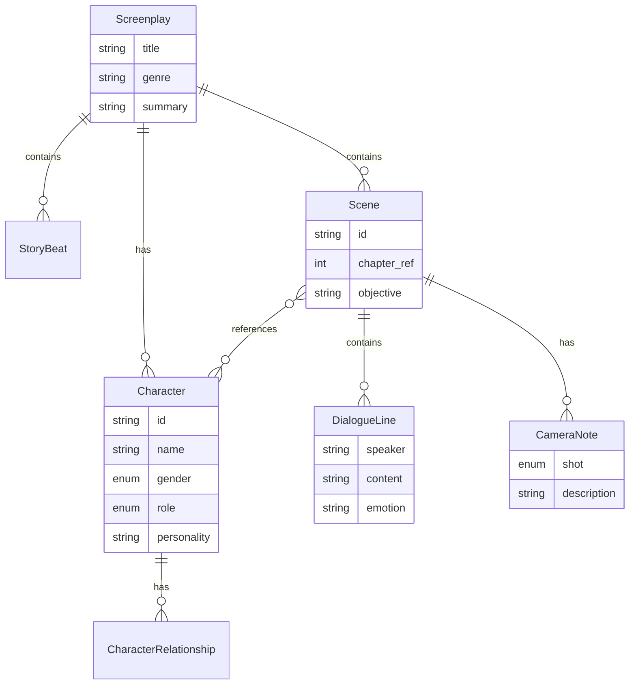

# AI Novel To Screenplay - YAML Schema 规范

## 1. Schema 设计目标

设计一个**工业级、可扩展、可读**的 YAML 剧本格式，满足以下需求：

- 编剧可直接阅读和编辑
- 可导入 Unity / Unreal / 剧本编辑器 / StoryBoard 工具
- 支持版本控制和 diff
- 向后兼容，新增字段不破坏旧剧本

## 2. 为什么选择 YAML

| 特性 | YAML | JSON |
|------|------|------|
| 可读性 | 高（无括号，缩进结构） | 低（大量引号和括号） |
| 注释 | 支持 `#` 注释 | 不支持 |
| 多行文本 | 原生支持 `|` `>` | 需要 `\n` 转义 |
| 编辑器友好 | 主流编辑器都有语法高亮 | 同样支持 |
| 影视行业 | 已有 YAML 剧本工具 | 较少 |

**为什么不使用 JSON？**
- JSON 不支持注释——剧本需要大量批注和修改说明
- JSON 的多行对白处理困难（需要 `\n` 转义）
- YAML 更接近人类阅读习惯，编剧可以直接编辑
- YAML 支持锚点引用（`&anchor` `*alias`），减少重复定义

## 3. 字段设计原则

1. **层级清晰**: title → characters → scenes → dialogue（从宏观到微观）
2. **ID 引用**: 角色通过 `char_xxx` ID 引用，而非名称，避免重名问题
3. **枚举约束**: 性别、角色类型、镜头类型使用枚举值，保证一致性
4. **可选字段**: 非核心字段设为可选，降低入门门槛
5. **扩展预留**: 每个对象保留扩展空间

## 4. 完整 Schema 结构

```yaml
title: string              # 剧本标题
genre: string              # 题材（fantasy, sci-fi, romance, ...）
author: string             # 原作者
summary: string            # 故事梗概

metadata:                  # 元信息
  generator: string        # 生成工具名称
  version: string          # 版本号
  source_chapters: int     # 来源章节数
  word_count: int          # 总字数
  processing_time_ms: int  # 处理耗时（毫秒）

characters:                # 角色列表
  - id: char_001           # 唯一标识
    name: string           # 角色名称
    gender: male|female|other
    age: int               # 年龄（可选）
    role: protagonist|supporting|antagonist|npc
    personality: string    # 性格描述
    goal: string          # 角色目标
    background: string    # 背景故事
    relationships:         # 关系列表
      - target_id: char_002
        relation: string   # 关系类型
        description: string

story_beats:               # 剧情节拍
  - id: beat_001
    name: string           # 节拍名称
    description: string    # 详细描述
    chapter_ref: int       # 所属章节
    scene_refs: []         # 关联场景ID
    beat_type: inciting_incident|rising_action|turning_point|climax|resolution
    emotional_tone: string # 情感基调

scenes:                    # 场景列表
  - id: scene_001
    chapter_ref: int       # 所属章节
    heading:               # 场景标题
      scene_type: interior|exterior|int_ext
      location: string     # 地点
      time: dawn|morning|noon|afternoon|evening|night|late_night
      description: string  # 环境描述
    participants: []       # 参与角色ID列表
    objective: string      # 剧情目标
    summary: string        # 场景概要
    dialogue:              # 对白列表
      - speaker: char_001
        content: string    # 对白内容
        subtext: string    # 潜台词
        emotion: string    # 情感
    action_lines: []       # 动作描述
    camera_notes:           # 镜头建议
      - shot: close_up|medium_shot|wide_shot|reaction_shot|pov|tracking|establishing|over_shoulder|two_shot|dutch_angle
        subject: string
        description: string
    duration_estimate: int # 预估时长（秒）

score:                     # 质量评分（可选）
  structure: 0-100
  dialogue: 0-100
  pacing: 0-100
  character_consistency: 0-100
  overall: 0-100

consistency_report:        # 一致性报告（可选）
  passed: bool
  issues: []
  issue_count: int
```

## 5. 可扩展性设计

### 自定义字段
在任意层级添加 `ext:` 前缀字段：

```yaml
scenes:
  - id: scene_001
    ext:studio_notes: "需要特效团队确认"
    ext:budget_level: "A"
```

### 导入导出映射

| YAML 字段 | Unity Timeline | Unreal Sequencer | Final Draft |
|-----------|---------------|------------------|-------------|
| scene.id | Track Name | Level Sequence Name | Scene Number |
| scene.heading.location | - | Sublevel Name | Scene Heading |
| dialogue.speaker | Signal Track | Event Name | Character Name |
| dialogue.content | Text Track | - | Dialogue |
| camera_notes.shot | Cinemachine Shot | Camera Cuts | Shot Type |
| scene.duration_estimate | Track Duration | Section Length | Page Count |
| scene.action_lines | Animation Track | Action Event | Action |

## 6. 与影视剧本格式映射

```
Final Draft (.fdx)  ←→  YAML Screenplay  ←→  Fountain (.fountain)
       ↓                       ↓                       ↓
  行业标准格式            中间交换格式             开源剧本格式
```

## 7. 示例

```yaml
title: 青云之巅
genre: fantasy
author: 佚名
summary: 废材少年林凡逆袭成为绝世强者

characters:
  - id: char_001
    name: 林凡
    gender: male
    age: 18
    role: protagonist
    personality: 坚毅果敢
    goal: 为师父报仇
    relationships:
      - target_id: char_002
        relation: 师徒
        description: 师父王海

scenes:
  - id: scene_001
    chapter_ref: 1
    heading:
      scene_type: interior
      location: 青云宗大殿
      time: morning
      description: 晨光穿透雕花木窗
    participants: [char_001, char_002]
    objective: 林凡质问师父
    dialogue:
      - speaker: char_001
        content: 师父，为何骗我？
        emotion: 愤怒
      - speaker: char_002
        content: 有些事你还不能知道。
        emotion: 无奈
    camera_notes:
      - shot: close_up
        subject: char_001
        description: 捕捉林凡眼中的怒火
      - shot: reaction_shot
        subject: char_002
        description: 王海的回避眼神
```

## 8. 字段解释表

| 字段路径 | 类型 | 必填 | 说明 |
|---------|------|------|------|
| title | string | 是 | 剧本标题 |
| genre | string | 否 | 题材分类 |
| author | string | 否 | 原书作者 |
| summary | string | 否 | 故事梗概 |
| characters[].id | string | 是 | 格式 char_NNN |
| characters[].name | string | 是 | 角色名称 |
| characters[].role | enum | 是 | protagonist/supporting/antagonist/npc |
| scenes[].id | string | 是 | 格式 scene_NNN |
| scenes[].heading.scene_type | enum | 是 | interior/exterior/int_ext |
| scenes[].heading.location | string | 是 | 场景地点 |
| scenes[].heading.time | enum | 是 | 时间枚举值 |
| scenes[].participants | string[] | 否 | 角色ID列表 |
| scenes[].dialogue[].speaker | string | 是 | 说话者角色ID |
| scenes[].dialogue[].content | string | 是 | 对白文本 |
| scenes[].camera_notes[].shot | enum | 否 | 镜头类型 |
| score.overall | int | 否 | 综合评分 0-100 |
| consistency_report.passed | bool | 否 | 一致性是否通过 |

## 9. UML 结构图

```
┌─────────────────────────────────────┐
│            Screenplay               │
├─────────────────────────────────────┤
│ + title: string                     │
│ + genre: string                     │
│ + author: string                    │
│ + summary: string                   │
│ + metadata: ScreenplayMetadata      │
│ + characters: Character[]           │
│ + story_beats: StoryBeat[]          │
│ + scenes: Scene[]                   │
│ + score?: ScoreBreakdown            │
│ + consistency_report?: dict         │
└──────────┬──────────┬───────────────┘
           │          │
     ┌─────▼──┐  ┌───▼──────────┐
     │Character│  │    Scene     │
     ├─────────┤  ├──────────────┤
     │+ id     │  │+ id          │
     │+ name   │  │+ chapter_ref │
     │+ gender │  │+ heading     │
     │+ age?   │  │+ participants│
     │+ role   │  │+ objective   │
     │+ ...    │  │+ dialogue[]  │
     └─────────┘  │+ camera[]    │
                  └──┬───────────┘
                     │
            ┌────────▼────────┐
            │  DialogueLine   │
            ├─────────────────┤
            │+ speaker: str   │
            │+ content: str   │
            │+ subtext: str   │
            │+ emotion: str   │
            └─────────────────┘
```

## 10. Mermaid 关系图


