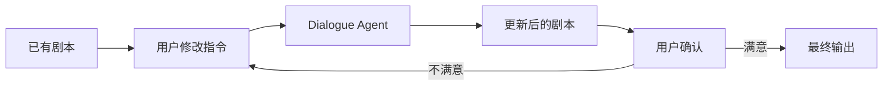

# Agent 工作流

## Mermaid 流程图

```mermaid
graph TD
    A[输入: 多章节小说] --> B[Novel Parser]
    B --> |chapters| C[Character Extractor]
    C --> |characters| D[Plot Analyzer]
    D --> |story_beats| E[Scene Splitter]
    E --> |scenes| F[Dialogue Generator]
    F --> |scenes with dialogue| G[Screenplay Assembler]
    G --> H[输出: YAML 剧本]

    subgraph 输出
        H
        I[质量评分 score]
        J[一致性报告 consistency_report]
    end

    G --> I
    G --> J

    style A fill:#1a1a2e,stroke:#7dd3fc
    style H fill:#1a1a2e,stroke:#a5d6a7
    style B fill:#162447,stroke:#4a9eff
    style C fill:#162447,stroke:#4a9eff
    style D fill:#162447,stroke:#4a9eff
    style E fill:#162447,stroke:#4a9eff
    style F fill:#162447,stroke:#4a9eff
    style G fill:#162447,stroke:#4a9eff
```

## 各节点说明

### 1. Novel Parser（小说解析）
- **输入**: 原始小说文本
- **处理**: 正则匹配章节标记（"第X章"/"Chapter X"），自动分段
- **输出**: `[{index, title, word_count, content}]`
- **容错**: 无标记时按 4000 字自动分片

### 2. Character Extractor（角色提取）
- **输入**: 章节列表
- **处理**: LLM 逐章提取角色信息，跨章合并去重
- **输出**: `[{id, name, gender, age, role, personality, goal, relationships}]`
- **约束**: 禁止编造不存在的角色

### 3. Plot Analyzer（剧情分析）
- **输入**: 章节摘要 + 角色列表
- **处理**: LLM 分析主线、支线、冲突、转折点
- **输出**: `{story_beats, main_plot, subplots, conflicts}`
- **策略**: 使用章节摘要而非全文，减少 token 消耗

### 4. Scene Splitter（场景拆分）
- **输入**: 章节全文 + 角色列表
- **处理**: 识别地点/时间切换点，拆分为可拍摄场景
- **输出**: `[{id, heading, participants, objective, action_lines}]`
- **策略**: 长章节分段处理（8000字/段）

### 5. Dialogue Generator（对白生成）
- **输入**: 场景 + 角色性格信息
- **处理**: 将叙述文字转换为口语化对白
- **输出**: `[{speaker, content, subtext, emotion}]`
- **约束**: 符合角色性格，每句不超 50 字

### 6. Screenplay Assembler（剧本组装）
- **输入**: 所有上游输出
- **处理**: 添加镜头建议、质量评分、一致性检查
- **输出**: 完整 YAML 剧本 + score + consistency_report

## 多轮修改流程

